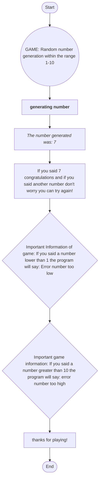

Textual description: The first step was to add a range of specific numbers within a circle to start the game,
then we put a box in which this random number is generated,
then in another box the generated number appears, then if you got it right you are congratulated and if you
failed you are invited to play again, then the user is told that if he says an amount less than the number 1 
an error will occur and finally the user is also told that if he says a number greater than 10 an error will
also occur but this time for a very high value and that's how my game ends.
